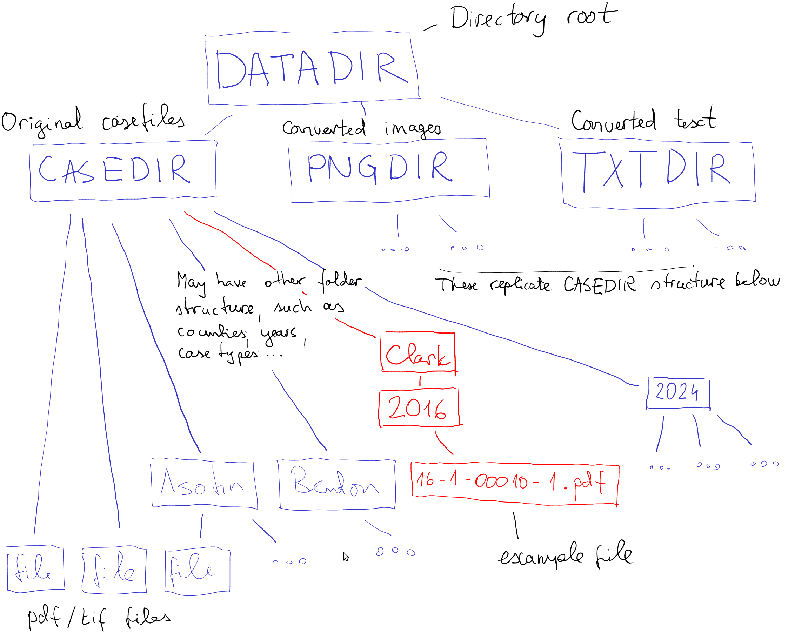

# How to use the code to OCR the documents

The script `pdf2txt.R` converts all the court documents in pdf/tif
form into text, and stores the results as an R data file
`converted-results.Rdat`.  It also stores the png and text versions of
all pages.


## The script

The script, `pdf2txt.R` can be run either through R console (inside
RStudio), or from command line.  It requires certain packages, in
particular _magick_ and _tesseract_ for converting images and doing
OCR.  There are a number of parameters to adjust according to your own
system, take a look at the beginning of the script.

When you start it for the first time, make it verbose
(e.g. `printLevel <- 2`) and run only a small sample of cases
(e.g. `sample <- 10`) to see if everything works well.  Expect the
conversion to take a number of hours for 1000 cases.

Unfortunately, tesseract outputs many warnings about too small
images.  These are harmless, but obscure more important information.
Typical warnings look like

> Image too small to scale!! (2x36 vs min width of 3)
> Line cannot be recognized!!

The script contains a lot of error handling code that makes it a bit
messy, this is largely to be able to catch conversion errors further
down the process.


## System requirements

The script uses the following packages: _magrittr_, _foreach_,
_pdftools_, _magick_ and _tesseract_.  The latter three are based
on external libraries, in particular _imagemagick_ and _tesseract_.
These will normally be installed together with the corresponding R
packages.

Out of these, imagemagick may cause trouble as its default
configuration may be rather restricted.  For instance, it may set low
memory and pixel size limits and not allow to write pdf documents.
The script tries to address
that by doing certain operations page-by-page, instead of reading all
document in as a whole.  But you may still run into errors like 

> Cannot read image ...
> <Magick::ErrorCache in eval(xpr, envir = envir): R: cache resources exhausted

This probably boils down to too low memory, pixel size, or file size
limits in the policy file.  The best solution is to change the
policies to be appropriate for this task.  The file is located at
`/etc/ImageMagick-6/policy.xml` on linux.  Unfortunately, both the
toolset and the documentation is geared toward experienced system
administration and not for the casual users.  Read the the
[Security Policy Doc](https://imagemagick.org/script/security-policy.php) 
to get a
taste. 

I have done the following changes in the `policy.xml` file, not sure
what is actually required:
```
  <policy domain="resource" name="memory" value="4GiB"/>
  <policy domain="resource" name="map" value="4GiB"/>
  <policy domain="resource" name="width" value="16KP"/>
  <policy domain="resource" name="height" value="16KP"/>
  <policy domain="resource" name="area" value="128MP"/>
  <policy domain="resource" name="disk" value="16GiB"/>
  <policy domain="coder" rights="read | write" pattern="PDF" />
```
(There are many more options that I haven't changed).


## Folder structure

The script needs to know a) where are the
original documents; b) where to store converted images; and c) where
to store converted text.  Both images and text are needed for OCR, but
are preserved mostly for troubleshooting purposes.  You may delete
these folders if all goes well.

The data should be stored as follows (see the figure below):

* There is a main folder **DATADIR**: the "root" of all data-related
  folders. 
* **CASEDIR**: folder that contains the scanned court documents.  This
  will normally reside inside DATADIR, but does not have to.  The
  documents should normally, in turn, be in two types of folders,
  `Exposure Cases` and `Outcome Cases` (note spacing and case),
  depending on the case type.  Inside of of these, the files
  should be split into folders for each county.  The case document
  files itself reside in the county-named folders.  They can be either
  .pdf or .tif type.
* **PNGDIR**: directory for the converted png files--for OCR,
  both pdf and tif images are first converted to png.  This will
  normally be inside DATADIR, but does not have to be.  The script
  will store the converted page png-s inside this folder.  The pages
  are arranged and named in the same way as the original casefiles,
  just have ending like `-001.png` for the first page, and so on.
  Converted
  png-s are only needed for troubleshooting, so if all is well, you
  can just delete this folder.  Expect png files for 1000 cases to
  take 1GB of disk space.
* **TXTDIR**: directory for the converted text files.  While the
  cleaned text will be put into the final
  data frame and saved to disk, the
  individual converted pages will be saved into TXTDIR, using the same
  arrangement as for the original case files.  These end with
  `-001.txt` for the first page, and so on.
  Unlike the results in the final
  data frame, these
  texts preserve all symbols and line breaks.
  Again, texts are mainly for
  troubleshooting, but can be useful for other of text-based
  tasks.  Expect the txt files to take 20MB of disk space 
  for 1000 cases.



These folder names should be set in the beginning of the script to
reflect the folder organization on your computer.


## Running the script

The script is basically just a loop over all the pdf/tif files in the
CASEDIR folder.  Files are first loaded, stored as png into PNGDIR,
and then converted to text and stored in TXTDIR.  This results in
separate image and text file for each page.

The script has a few tuning parameters:

* `printLevel`: work verbosity.  The larger number prints more, "2"
  (default), prints each case file name as it goes.
* `outFName`: name of the output file--the data frame where the
  extracted text is stored.  Default is "converted-results.Rdat".  You
  can as well use the default name and rename it afterward.
* `sample`: how big a sample to process.  "0" mean to convert all
  files, "10" means to convert only 10 cases, selected by
  random.  Useful for testing/troubleshooting.


## Outcome

The results are saved in
`converted-results.Rdat` (in R format).  This contains a data frame
called _results_ with columns

* **subfolder**: subfolder inside case type (exposure/outcome)
  folder, normally the
  county name. 
* **filename**: the name of the original file
* **pages**: the page count of the original file
* **type**: either _exposure_ or _outcome_
* **text**: the case text.  All pages are collapsed into a single
  string, line breaks are replaced with a space.


## Authors

Kaidi Chen (陈凯迪), Ott (奥特) Toomet 
[CC0 1.0 Universal](https://creativecommons.org/publicdomain/zero/1.0/)
